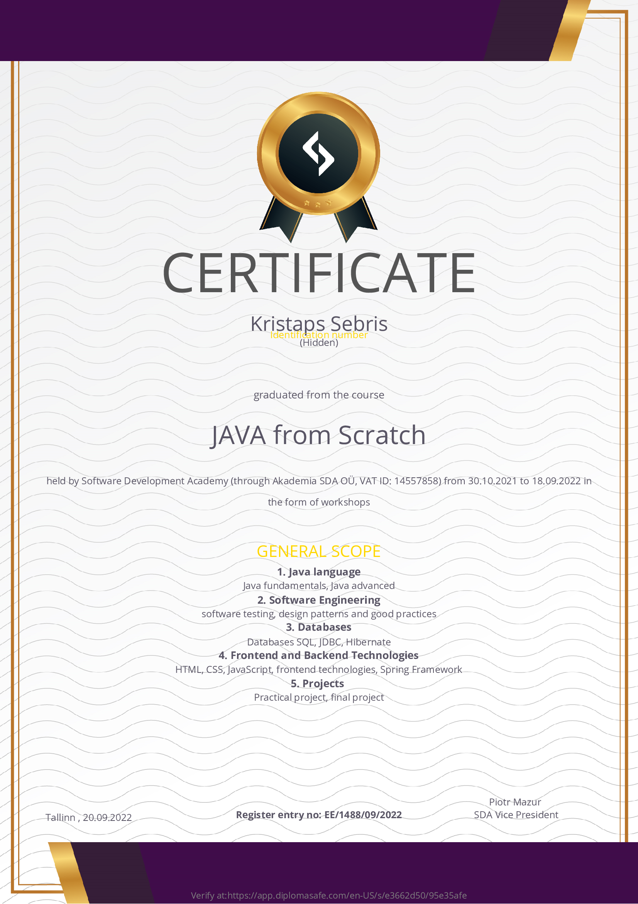
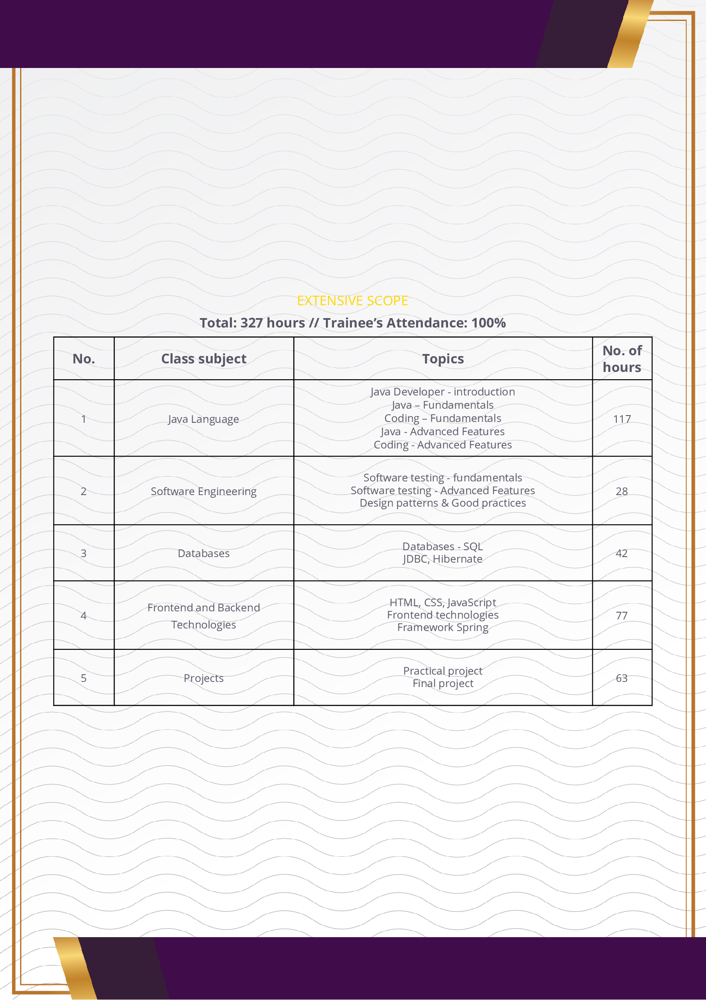

# Kristaps Sebris

## About me

Hi! My name is Kristaps Sebris and I am a beginning software developer. At this point I would like to share with you my experience and projects I had the pleasure to work on so far.

## Programming

My professional experience has included different jobs. 
However, I always kept the idea of becoming a programmer in the back of my head until I decided to follow my dream and graduated from Software Development Academy in 09.2022 (JAVA from Scratch course).
When I am passionate about something, it is very difficult for me to stop doing it. 
Programming is my passion and I am determined to continuously improve my programming skills. 
As a person I am open-minded and hardworking, not afraid of taking initiative.

## Software Development Academy course

I had the pleasure to participate in the "Java from scratch" course organized by Software Development Academy. During over 300 hours of classes and many hours devoted to independent work, I gained knowledge on the following topics:

Participating in the course also enabled me to navigate efficiently in agile projects thanks to the classes introducing the Scrum methodology.

## Git and HTTP
During the course, I not only learned programming in Java, but also developed my skills in many other directions, including:

* I learned to work with the GIT Tool (and Gitlab)

* I learned the basics of REST API and networking tools, thanks to which I will be able to provide support during the back-end debugging process in my future work.

## Software Testing

I know that modern projects should not only be characterized by a well-designed, scalable, and easily maintainable architecture. 
However, it also should be properly tested at the level of unit and integration tests. 
During the course I learned testing methodologies and techniques.

## Technologies

## Interests
Programming is not everything, I like to play basketball and do extreme activities in my spare time.

## Contact

You can contact me through [LinkedIn](https://www.linkedin.com/in/kristaps-sebris-hire-me/)

